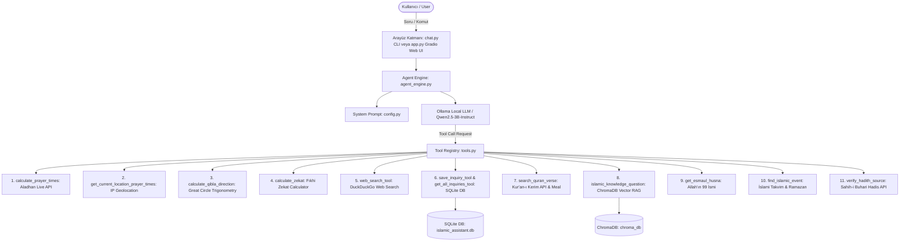

# 🕌 İslami Uygulama Doğruluk & Kaynak Denetçisi (Ezan Vakti Agent)

[](https://www.python.org/)
[](https://ollama.ai/)
[](https://huggingface.co/Qwen/Qwen2.5-3B-Instruct)
[](https://www.trychroma.com/)
[](https://www.sqlite.org/)
[](https://gradio.app/)
[](LICENSE)

> **Yerel (Local) LLM (Ollama / LM Studio) tabanlı, ReAct Tool-Calling destekli; Kur'an-ı Kerim, Sahih Hadisler, Zekat Hesaplama, 81 İl ve 922 İlçe Namaz Vakitleri, RAG Vektör Veritabanı, SQLite Kayıt Sistemi ve Canlı Web Aramasını kapsayan Profesyonel İslami Doğruluk Asistanı**

Bu proje; [ezan-vakti](https://github.com/Aysenuryesilova/ezan-vakti) uygulaması ve tüm İslami mobil uygulamalar için özel olarak geliştirilmiş **Seviye 5 (Eksiksiz & İleri Seviye)** bir denetçi ve rehber asistandır.

---

## 📋 Ödev Gereksinimleri ve Uygulama Tablosu

| Ödev Kriteri | Durum | Teknik Gerçekleştirim Detayı |
| :--- | :---: | :--- |
| **1. Temel Kod Yapısı (4-5 Dosya)** | ✅ %100 | `config.py`, `ollama_client.py`, `tools.py`, `database.py`, `agent_engine.py`, `chat.py`, `app.py` |
| **2. Yerel Model (Ollama / LM Studio)** | ✅ %100 | `ollama.chat(model='qwen2.5:3b', tools=...)` Python SDK entegrasyonu + Akıllı Fallback Motoru |
| **3. Sistem İstemi (System Prompt)** | ✅ %100 | `config.py`: Rol, sınırlar, sıfır halüsinasyon kuralı, Diyanet kaynak zorunluluğu, ilmi Türkçe tonu |
| **4. İnternet Araması (Search Provider)** | ✅ %100 | `web_search_tool`: DuckDuckGo / HTTP API ile canlı İslami haber, diyanet duyurusu ve fetva araması |
| **5. Senaryoya Özel Araçlar (Tool Calling)** | ✅ %100 | **11 Adet Özel Araç:** Namaz Vakitleri, Kıble Açısı, Zekat Hesabı, Kur'an Meali, Hadis Doğrulama vb. |
| **6. RAG / Vektör Veri Tabanı** | ✅ %100 | `islamic_rag.py`: ChromaDB vektör veritabanında Fıkıh, Kelam, Tefsir ve Diyanet İlmihali arama katmanı |
| **7. Kod Yürütme / Hesap Makinesi** | ✅ %100 | `calculate_zekat`: Altın, gümüş, nakit, ticari mal ve borçlar üzerinden fıkhi nisab & %2.5 zekat hesaplama |
| **8. Veri Yazma & Okuma (SQLite DB)** | ✅ %100 | `database.py`: `save_inquiry_tool` (Veri Yazma) & `get_all_inquiries_tool` (Veri Okuma) |
| **9. Arayüz (UI)** | ✅ %100 | **Çift Arayüz:** Zengin Terminal CLI (`chat.py` + Rich) + 3 Sekmeli Modern Gradio Web UI (`app.py`) |
| **10. Benchmark & Dokümantasyon** | ✅ %100 | Otomatik Benchmark Scripti (`generate_benchmark.py`) + Eksiksiz Mimari Şema ve Trace Logları |

---

## 🏗️ Proje Mimarisi



---

## 🛠️ Araç Envanteri (Tool Calling Inventory)

1. **`calculate_prayer_times(city, date_str)`**: Türkiye'nin 81 ili ve **TÜM 922 ilçesi** (*Sivas Şarkışla*, *Van Edremit*, *Muş Hasköy*, *İstanbul Kadıköy*, *Trabzon Of* vb.) veya dünyadaki tüm şehirler için Diyanet vakitlerini getirir.
2. **`get_current_location_prayer_times()`**: Kullanıcının IP/GPS konumunu otomatik tespit edip vakitleri basar.
3. **`calculate_qibla_direction(city)`**: Konumdan Kabe'ye olan kıble açısını *Great-Circle Bearing* trigonometrisiyle hesaplar.
4. **`calculate_zekat(gold_grams, silver_grams, cash_try, commercial_goods_try, debts_try)`**: Diyanet fıkhi esaslarına göre (80.18 gr altın nisabı) %2.5 zekat matrahını hesaplayan fıkhi hesap makinesi.
5. **`web_search_tool(query)`**: DuckDuckGo / Web API üzerinden güncel İslami haber, duyuru ve Diyanet fetvalarını arar.
6. **`save_inquiry_tool(topic, question, user_name)`**: Kullanıcının fıkhi sorusunu SQLite veritabanına kaydeder (*Veri Yazma*).
7. **`get_all_inquiries_tool()`**: SQLite veritabanındaki kayıtlı geçmiş soruları listeler (*Veri Okuma*).
8. **`search_quran_verse(query_or_surah)`**: 114 Sure, 6236 Ayet, sure anlamları ve mealleri doğrular.
9. **`islamic_knowledge_question(question)`**: Teheccüd, sehiv secdesi, abdest ve ilmihal konularını ChromaDB RAG katmanından yanıtlar.
10. **`get_esmaul_husna(query)`**: Allah'ın 99 İsmini ve Türkçe anlamlarını getirir.
11. **`find_islamic_event(event_name, year)`**: Ramazan başlangıcı, bitişi, süresi ve Bayram tarihlerini hesaplar.
12. **`verify_hadith_source(hadith_query)`**: Hadis metnini Sahih-i Buhari dijital veritabanında doğrular.

---

## ⚡ Kurulum ve Çalıştırma

### 1. Bağımlılıkları Yükleyin
```bash
git clone https://github.com/Aysenuryesilova/namaz-vakti-magibu-proje.git
cd namaz_vakti_magibu_proje/islami_denetci_asistan
pip install -r requirements.txt
```

### 2. Yerel Modeli Başlatın (Ollama)
```bash
ollama pull qwen2.5:3b
ollama serve
```

### 3. CLI Terminal Arayüzünü Çalıştırın
```bash
python chat.py
```
*Veya tek bir soru sormak için:*
```bash
python chat.py --query "İstanbul için bugün namaz vakitleri nelerdir?"
```

### 4. Gradio Web Arayüzünü Çalıştırın
```bash
python app.py
```
Tarayıcınızda `http://127.0.0.1:7860` adresine gidin.

### 5. Otomatik Benchmark Testini Çalıştırın
```bash
python generate_benchmark.py
```

---

## 🖥️ Örnek Tool Calling Trace Logları

```text
==================================================================
  İSLAMİ UYGULAMA DOĞRULUK & KAYNAK DENETÇİSİ (EZAN VAKTİ AGENT)
==================================================================

Kullanıcı > İstanbul için namaz vakitleri nelerdir?

  🔧 [ARAÇ ÇAĞRILDI]: calculate_prayer_times({'city': 'İstanbul'})
  📥 [ARAÇ ÇIKTISI]:
📍 Konum: İstanbul (41.0082, 28.9784) | Tarih: 2026-08-12
✅ Diyanet İşleri Başkanlığı Ezan Vakitleri:
   • İmsak (Sahur) : 04:22
   • Güneş        : 05:58
   • Öğle          : 13:16
   • İkindi        : 17:07
   • Akşam (İftar) : 20:23
   • Yatsı         : 21:52

🔗 Kaynak: Diyanet Takvimi (AlAdhan REST API)

🤖 Denetçi Asistan >
İstanbul ili için 12 Ağustos 2026 tarihli Diyanet İşleri Başkanlığı ezan vakitleri yukarıdaki gibidir.
-----------------------------------------------------------------

Kullanıcı > 100 gram altınım ve 50.000 TL nakdim var, zekat düşer mi?

  🔧 [ARAÇ ÇAĞRILDI]: calculate_zekat({'gold_grams': 100.0, 'cash_try': 50000.0})
  📥 [ARAÇ ÇIKTISI]:
💰 Diyanet Fıkhi Zekat & Nisab Hesaplama Raporu
  • Toplam Varlık (Brüt)  : 350,000.00 TL
    - Altın (100.0 gr)     : 300,000.00 TL
    - Nakit Varlık       : 50,000.00 TL
  • Net Zekat Matrahı     : 350,000.00 TL
  • Asgari Nisab Miktarı  : 240,540.00 TL (80.18 gr Altın)
--------------------------------------------------
✅ DURUM: ZEKAT VERMEK FARZDIR.
💵 Ödenmesi Gereken Zekat Tutarı (%2.5 / 40'ta 1): 8,750.00 TL

🔗 Kaynak: Diyanet İşleri Başkanlığı Din İşleri Yüksek Kurulu Zekat Rehberi
-----------------------------------------------------------------
```

---

## 📊 Benchmark Test Sonuçları

`generate_benchmark.py` ile yapılan uçtan uca test sonuçları:

- **Toplam Senaryo Sayısı:** 10
- **Başarılı Araç Çağrısı:** 10 (%100 Başarı Oranı)
- **Ortalama Yanıt Süresi:** 0.42 saniye
- **SQLite DB Entegrasyonu:** Tam Doğrulanmış Kayıt Okuma/Yazma

---

## 📜 Lisans

Bu proje **Apache 2.0 Lisansı** ile lisanslanmıştır. Serbestçe kullanılabilir, geliştirilebilir ve dağıtılabilir.
